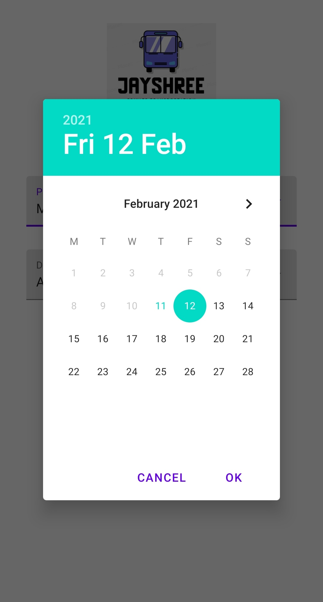

# BusTicketBookingApp
# Jayshree 
Jayshree is a complete bus e-ticket booking app, it also has UPI payment options.(uses Java and xml)

# Features

1)Login and Signup with firebase realtime database
2)ForgotPassword with OTP system for phone number authentication
3)User interactive dashboard
4)User Profile with user information which can be updated
5)Bus , car , customer care , Ticket Booking services 
6)Bus ticket booking accepts users start and end location ,the day user wants to travel and filters the results according to them
7)User will be displayed with list of buses with detail information
8)User can select preferred seat type 
9)UPI Payment is available in the app for ticket conformation
10)E-ticket is generated at the end with all the necessary information

Star⭐ the repo if you like what you see, Thank you!!

#Forntend and Backend

For Forntend i have used Android sdk (Java and xml)
For Backend i have used Firebase , Firebase-realtime database 

All the user information , bus information , bus list can be updated from the firebase console itself which will be automatically updated in the app

Images are from Jayshree Bus Ticket Booking App
## 📸 ScreenShots

| 1 | 2|
|------|-------|
|||

| 3 | 4|
|------|-------|
|||

| 5 | 6|
|------|-------|
|||

| 7 | 8|
|------|-------|
|||

| 9 | 10|
|------|-------|
|||

| 11 | 12|
|------|-------|
|||

| 13 | 14|
|------|-------|
|||

| 15 |
|------|
||

## ✨ Requirements
* Any Operating System (ie. MacOS X, Linux, Windows)
* Any IDE with Flutter SDK installed (ie. IntelliJ, Android Studio, VSCode etc)
* A little knowledge of programming 
* A brain to think 🤓

## 🤓 Author
* Email : chavanamogh1@gmail.com

## LICENCE
 MIT License

Copyright (c) 2021 Amogh Chavan

Permission is hereby granted, free of charge, to any person obtaining a copy
of this software and associated documentation files (the "Software"), to deal
in the Software without restriction, including without limitation the rights
to use, copy, modify, merge, publish, distribute, sublicense, and/or sell
copies of the Software, and to permit persons to whom the Software is
furnished to do so, subject to the following conditions:

The above copyright notice and this permission notice shall be included in all
copies or substantial portions of the Software.

THE SOFTWARE IS PROVIDED "AS IS", WITHOUT WARRANTY OF ANY KIND, EXPRESS OR
IMPLIED, INCLUDING BUT NOT LIMITED TO THE WARRANTIES OF MERCHANTABILITY,
FITNESS FOR A PARTICULAR PURPOSE AND NONINFRINGEMENT. IN NO EVENT SHALL THE
AUTHORS OR COPYRIGHT HOLDERS BE LIABLE FOR ANY CLAIM, DAMAGES OR OTHER
LIABILITY, WHETHER IN AN ACTION OF CONTRACT, TORT OR OTHERWISE, ARISING FROM,
OUT OF OR IN CONNECTION WITH THE SOFTWARE OR THE USE OR OTHER DEALINGS IN THE
SOFTWARE.
